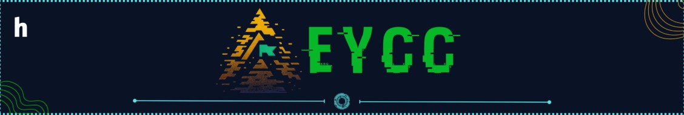
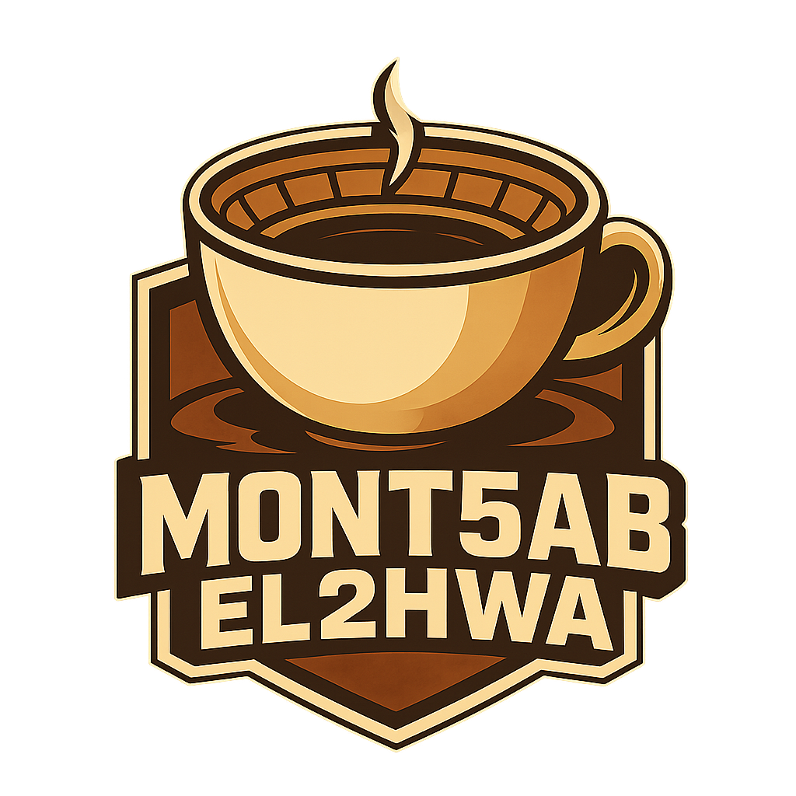

# Egyptian Youth Cybersecurity Challenge (EYCC) 2026

---

## About

All challenges, source code, and writeups from **EYCC CTF 2026** · Egypt's national CTF for students **(Grades 7–13)**.  
New to CTFs? Check out [What is a CTF?](https://www.geeksforgeeks.org/ethical-hacking/what-is-ctfs-capture-the-flag/), watch [So, You Wanna Do Security?](https://www.youtube.com/watch?v=i8rizLc4hc0), or follow the [FahemSec Roadmaps](https://fahemsec.com/roadmaps).

| | |
| --- | --- |
| **Organizers** |  [Hack Club of STEM Egypt](https://stemeghackclub.org/) |
| **Partners** |  [Mont5ab El2hwa (منتخب القهوة)](https://2hwa.xyz/) |
| **CTFtime** |  [EYCC Qualifiers](https://ctftime.org/event/3353) · [EYCC Finals](https://ctftime.org/event/3405) |
| **Community** |  [EYCC Server](https://discord.gg/nfyR83h8kC) · [2HWA Server](https://discord.gg/djpMH7sXuX) |

---

## Challenges

- **Reverse Engineering**
  1. Metoubas v1 · `Quals` · [Access Challenge](https://2hwa.xyz/eycc-ctf-2026/metoubas-v1/)
  2. Metoubas v2 · `Quals` · [Access Challenge](https://2hwa.xyz/eycc-ctf-2026/metoubas-v2/)
  3. Metoubas v3 · `Quals` · [Access Challenge](https://2hwa.xyz/eycc-ctf-2026/metoubas-v3/)
  4. Easy .NET · `Quals` · [Access Challenge](https://2hwa.xyz/eycc-ctf-2026/easy-net/)
  5. Late WarmUp · `Quals` · [Access Challenge](https://2hwa.xyz/eycc-ctf-2026/late-warmup/)
  6. Normal License Validator · `Quals` · [Access Challenge](https://2hwa.xyz/eycc-ctf-2026/normal-license-validator/)
  7. BabyStep · `Finals` · [Access Challenge](https://2hwa.xyz/eycc-ctf-2026/babystep/)
  8. BabyStepV2 · `Finals` · [Access Challenge](https://2hwa.xyz/eycc-ctf-2026/babystepv2/)
  9. Operation: GANBAR | Free Photoshop · `Finals` · [Access Challenge](https://2hwa.xyz/eycc-ctf-2026/free-photoshop/)
  10. Operation: GANBAR | natega.xls · `Finals` · [Access Challenge](https://2hwa.xyz/eycc-ctf-2026/operation-ganbar-natega-xls/)

- **Digital Forensics**
  1. Ghost in the Hall · `Quals` · [Access Challenge](https://2hwa.xyz/eycc-ctf-2026/ghost-in-the-hall/)
  2. TickTock · `Quals` · [Access Challenge](https://2hwa.xyz/eycc-ctf-2026/tick-tock/)
  3. Trust Issue · `Quals` · [Access Challenge](https://2hwa.xyz/eycc-ctf-2026/trust-issue/)
  4. Silent Access · `Finals` · [Access Challenge](https://2hwa.xyz/eycc-ctf-2026/silent-access/)
  5. Simple Silent Access · `Finals`
  6. Operation: GANBAR | TopSecret Fallines · `Finals` · [Access Challenge](https://2hwa.xyz/eycc-ctf-2026/operation-ganbar-topsecret-fallines/)

- **Web Exploitation**
  1. Mall Albostan · `Quals` · [Access Challenge](https://2hwa.xyz/eycc-ctf-2026/mall-albostan/)
  2. Brew Bank · `Quals` · [Access Challenge](https://2hwa.xyz/eycc-ctf-2026/brew-bank/)
  3. Brew Bank Revenge · `Quals` · [Access Challenge](https://2hwa.xyz/eycc-ctf-2026/brew-bank-revenge/)
  4. NimbusPages · `Quals` · [Access Challenge](https://2hwa.xyz/eycc-ctf-2026/nimbuspages/)
  5. shay blaban · `Quals` · [Access Challenge](https://2hwa.xyz/eycc-ctf-2026/shay-blaban/)
  6. Access Denied · `Quals`
  7. MediVault_v2 · `Quals`
  8. Beyond the Shell · `Quals`
  9. Edu_SVG · `Quals`
  10. Krusty Krab Order Boards · `Finals` · [Access Challenge](https://2hwa.xyz/eycc-ctf-2026/krusty-krab-order-boards/)
  11. Rising Star · `Finals` · [Access Challenge](https://2hwa.xyz/eycc-ctf-2026/rising-star/)
  12. CoffeeHub · `Finals` · [Access Challenge](https://2hwa.xyz/eycc-ctf-2026/coffeehub/)
  13. CoffeeHub Revenge · `Finals` · [Access Challenge](https://2hwa.xyz/eycc-ctf-2026/coffeehub-revenge/)
  14. sql? no sql · `Finals` · [Access Challenge](https://2hwa.xyz/eycc-ctf-2026/sql-no-sql/)
  15. vantage · `Finals`

- **Mobile Security**
  1. Warmup · `Quals` · [Access Challenge](https://2hwa.xyz/eycc-ctf-2026/warmup/)
  2. Sandy VS Frida · `Quals` · [Access Challenge](https://2hwa.xyz/eycc-ctf-2026/sandy-vs-frida/)
  3. Krusty Krab Vault · `Finals` · [Access Challenge](https://2hwa.xyz/eycc-ctf-2026/krusty-krab-vault/)
  4. SpongeBob's Photo Blog · `Finals` · [Access Challenge](https://2hwa.xyz/eycc-ctf-2026/spongebobs-photo-blog/)
  5. Chainme · `Finals` · [Access Challenge](https://2hwa.xyz/eycc-ctf-2026/chainme/)

- **Cryptography**
  1. hehe · `Quals` · [Access Challenge](https://2hwa.xyz/eycc-ctf-2026/hehe/)
  2. spider man far from home · `Quals` · [Access Challenge](https://2hwa.xyz/eycc-ctf-2026/spider-man-far-from-home/)
  3. Silent Echo · `Quals`
  4. Rookie Mistake · `Quals`
  5. Iron Vault · `Quals`
  6. The lattice madness · `Finals` · [Access Challenge](https://2hwa.xyz/eycc-ctf-2026/the-lattice-madness/)
  7. babyECDSA · `Finals` · [Access Challenge](https://2hwa.xyz/eycc-ctf-2026/babyecdsa/)
  8. ccrypt · `Finals` · [Access Challenge](https://2hwa.xyz/eycc-ctf-2026/ccrypt/)
  9. Zee Kalmar Playground · `Finals` · [Access Challenge](https://2hwa.xyz/eycc-ctf-2026/zee-kalmar-playground/)
  10. 101 RSA · `Finals` · [Access Challenge](https://2hwa.xyz/eycc-ctf-2026/101-rsa/)

- **OSINT**
  1. 2Face-Graduation · `Quals` · [Access Challenge](https://2hwa.xyz/eycc-ctf-2026/2face-graduation/)
  2. Kazyon · `Quals` · [Access Challenge](https://2hwa.xyz/eycc-ctf-2026/kazyon/)
  3. Infected · `Quals` · [Access Challenge](https://2hwa.xyz/eycc-ctf-2026/infected/)
  4. NPM NIGHTMARE · `Quals` · [Access Challenge](https://2hwa.xyz/eycc-ctf-2026/npm-nightmare/)
  5. The last Note · `Quals`
  6. Leaky Pixels · `Quals`
  7. DPOsint 2.0 · `Quals`
  8. Traceback · `Quals`
  9. JOSINT · `Quals`
  10. ALOSINT · `Quals`
  11. Infected Revenge · `Finals` · [Access Challenge](https://2hwa.xyz/eycc-ctf-2026/infected-revenge/)
  12. actor Inv · `Finals`

- **Binary Exploitation**
  1. birdguard · `Quals` · [Access Challenge](https://2hwa.xyz/eycc-ctf-2026/birdguard/)
  2. notekeeper · `Quals` · [Access Challenge](https://2hwa.xyz/eycc-ctf-2026/notekeeper/)
  3. Wind · `Finals` · [Access Challenge](https://2hwa.xyz/eycc-ctf-2026/wind/)

- **Miscellaneous**
  1. Details Never Appear · `Quals` · [Access Challenge](https://2hwa.xyz/eycc-ctf-2026/details-never-appear/)
  2. Look Closer · `Quals` · [Access Challenge](https://2hwa.xyz/eycc-ctf-2026/look-closer/)
  3. Escape From SpongeBob · `Finals` · [Access Challenge](https://2hwa.xyz/eycc-ctf-2026/escape-from-spongebob/)
  4. Ghost · `Finals` · [Access Challenge](https://2hwa.xyz/eycc-ctf-2026/ghost/)

---

## Team Credits for EYCC CTF 2026

### EYCC Team

| Member | Profile |
| :--- | :--- |
| Ahmed Helmy | [LinkedIn](https://www.linkedin.com/in/ahmed-helmy-306607350/) |
| Yousef Habib | [LinkedIn](https://www.linkedin.com/in/usef-7abib/) |
| Adham Shawki | [LinkedIn](https://www.linkedin.com/in/adham-shawki-135034204/) |

### Mont5ab El2hwa

| Author | Profile |
| :--- | :--- |
| Mahmoud Elkhateb | [`@elkhatebx22`](https://2hwa.xyz/elkhatebx22) |
| Ibrahim Saeid | [`@babayaga0x01`](https://2hwa.xyz/babayaga0x01) |
| Ibrahim (the crypto guy) | [`@vr3e`](https://www.linkedin.com/in/ibrahim-adel-6437b123b/) |
| Abdelrahman Walid | [`@Abdelrahman_483`](https://2hwa.xyz/abdelrahman9969) |
| Abdelrahman Radwan | [`@agn4by`](https://2hwa.xyz/Agn4by) |
| Abdelrahman Ahmed | [`@0x2face`](https://2hwa.xyz/0x2face) |
| Ahmed Sherif | [`@k45w4ra`](https://2hwa.xyz/k45w4ra) |
| Ali Sherif | [`@spect3r`](https://2hwa.xyz/Spect3r) |
| Adham Khairy | [`@Sponge`](https://2hwa.xyz/0xsponge) |
| Omar Elgayar | [`@OG13`](https://2hwa.xyz/OG13) |
| Mohamed Younis | [`@mo_younis`](https://2hwa.xyz/Y0un15) |
| Mohamed Aly | [`@00xcanelo`](https://2hwa.xyz/00xcanelo) |
| Mohamed Hegazy | [`@binbash`](https://2hwa.xyz/0xheg3zy) |
| Mahmoud Mostafa | [`@M-Ab0L3TA`](https://2hwa.xyz/MAb0EL3TA) |
| Mohamed Bakr | [`@烈火`](https://2hwa.xyz/0xreizouko) |
| Mohammed Abdallah | [`@mo.ha08`](#) |

---

## License

This repository and its challenge materials are released under the [MIT License](LICENSE) for educational purposes. All materials and writeups belong to their respective authors and Mont5ab El2hwa.

---

**[Egyptian Youth Cybersecurity Challenge (EYCC)](https://stemeghackclub.org/)** × **[Mont5ab El2hwa](https://2hwa.xyz/)**

